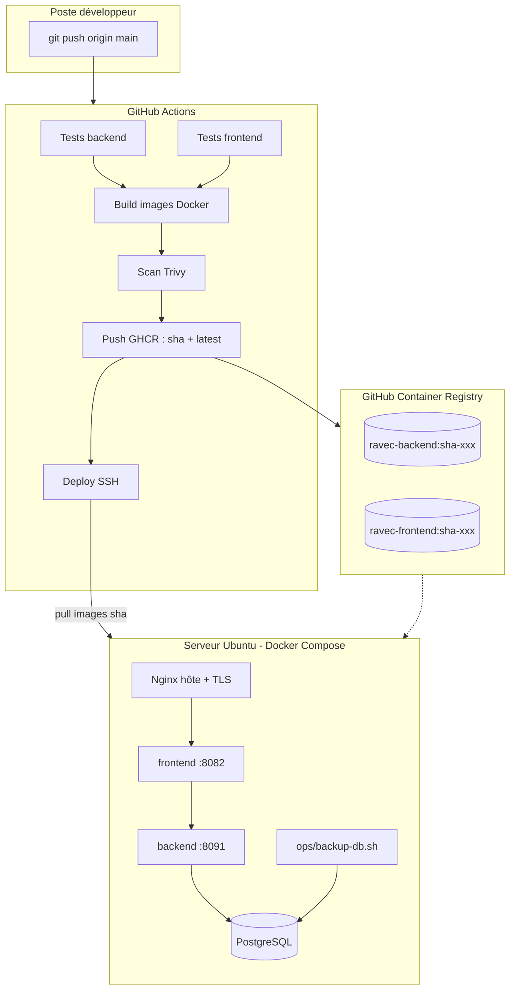
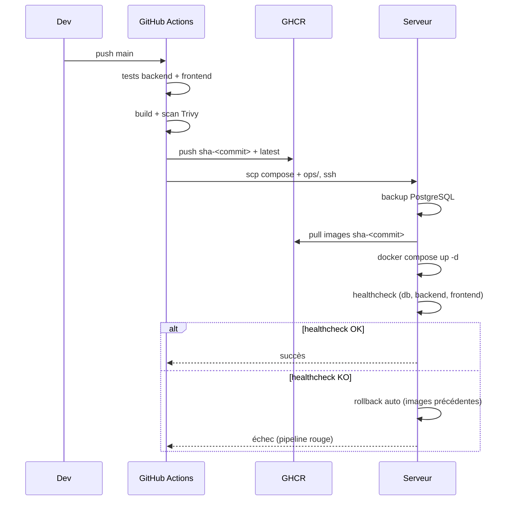

# Architecture CI/CD — PN-RAVEC

> Plateforme d'état civil (RAVEC). Backend Spring Boot, frontend Angular, PostgreSQL,
> conteneurisé via Docker, déployé sur un serveur Ubuntu unique avec Docker Compose.
> Registry : GitHub Container Registry (GHCR).

## 1. Vue d'ensemble

## 2. Composants

| Composant | Techno | Image | Port interne | Exposition |
|-----------|--------|-------|--------------|------------|
| Frontend  | Angular 17 + Nginx | `ghcr.io/lamarana55/ravec-frontend` | 80 | `127.0.0.1:8082` |
| Backend   | Spring Boot 3 / Java 21 | `ghcr.io/lamarana55/ravec-backend` | 8091 | interne (réseau Docker) |
| Base      | PostgreSQL 15 | `postgres:15-alpine` | 5432 | interne |
| PgAdmin   | (profil `tools`) | `dpage/pgadmin4` | 80 | `127.0.0.1:5051` |

Le backend **n'est jamais exposé** sur l'hôte : seul le frontend (Nginx) l'atteint via
le réseau Docker `ravec-pn-network`. Le TLS est géré par le Nginx/Certbot de l'hôte.

## 3. Flux de déploiement (résumé)

## 4. Versionnage des images

- **`sha-<commit>`** : tag déterministe utilisé pour le déploiement et le rollback.
- **`latest`** : commodité (dernier build de `main`), **non** utilisé pour déployer.

Le serveur déploie toujours par `sha-<commit>` → tout déploiement est traçable et
reproductible, et le rollback consiste à redéployer un `sha-` antérieur.

## 5. Réseaux & volumes

- Réseau applicatif isolé : `ravec-pn-network` (bridge).
- Volumes persistants : `ravec_pn_postgres_data`, `ravec_pn_backend_logs`, `ravec_pn_pgadmin_data`.
- Observabilité (optionnelle) : réseau `observability` + volumes Prometheus/Grafana/Loki.

## 6. Fichiers clés

| Fichier | Rôle |
|---------|------|
| `.github/workflows/ci.yml` | Tests sur PR / branches |
| `.github/workflows/cd.yml` | Pipeline complet sur `main` |
| `.github/workflows/rollback.yml` | Rollback manuel |
| `docker-compose.server.yml` | Stack de production (source unique) |
| `.env.server.example` | Modèle de configuration serveur |
| `ops/backup-db.sh` / `restore-db.sh` | Sauvegarde / restauration PostgreSQL |
| `ops/rollback.sh` | Rollback applicatif |
| `ops/healthcheck.sh` | Vérification post-déploiement |
| `monitoring/` | Stack Prometheus/Grafana/Loki (préparée) |

Voir aussi : [DEPLOYMENT.md](DEPLOYMENT.md) · [ROLLBACK.md](ROLLBACK.md) ·
[BACKUP.md](BACKUP.md) · [GITHUB_ACTIONS.md](GITHUB_ACTIONS.md).
