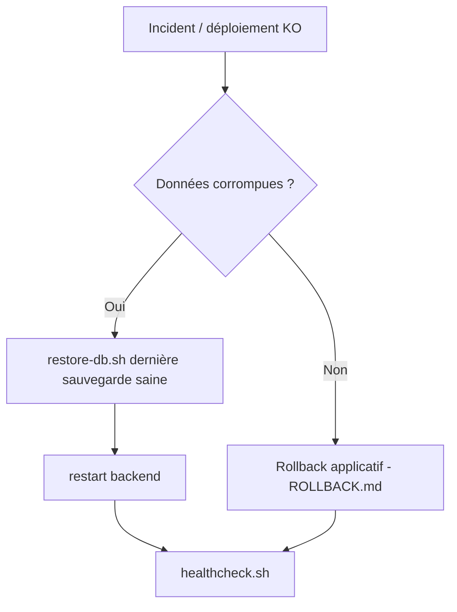

# Sauvegarde & Restauration PostgreSQL — PN-RAVEC

Objectif : **aucune perte de données** en cas d'échec de déploiement ou d'incident.

## 1. Sauvegarde automatique

Le pipeline lance `ops/backup-db.sh` **avant chaque déploiement** (et chaque rollback).
La sauvegarde est aussi planifiable par cron.

```bash
./ops/backup-db.sh
```

Produit : `backups/ravec_<db>_<horodatage>.sql.gz` + lien `backups/latest.sql.gz`.

### Rotation
Les sauvegardes de plus de `BACKUP_RETENTION_DAYS` jours (défaut **14**) sont supprimées
automatiquement. Configurable dans `.env` :

```bash
BACKUP_RETENTION_DAYS=14
```

### Planification (cron, recommandé : 1×/jour à 02h00)

```bash
crontab -e
# Ajouter :
0 2 * * * cd /opt/pn-ravec && ./ops/backup-db.sh >> backups/backup.log 2>&1
```

## 2. Restauration

```bash
cd /opt/pn-ravec

# Depuis la dernière sauvegarde
./ops/restore-db.sh

# Depuis une sauvegarde précise
./ops/restore-db.sh backups/ravec_ravec_db_20260622_020000.sql.gz
```

Le script :
1. demande une **confirmation** (taper `oui`) — ou `FORCE=yes` pour automatiser ;
2. effectue une **sauvegarde de sécurité** préalable ;
3. restaure le dump dans la base ;
4. recommande un redémarrage du backend.

```bash
docker compose -f docker-compose.server.yml --env-file .env restart backend
```

## 3. Procédure de reprise après incident



## 4. Bonnes pratiques

- **Copie hors-serveur** : répliquer `backups/` vers un stockage distant (rsync/objet S3)
  pour survivre à une perte du serveur.
- **Tester la restauration** régulièrement (un backup non testé n'est pas un backup).
- Vérifier l'espace disque : `du -sh /opt/pn-ravec/backups`.
