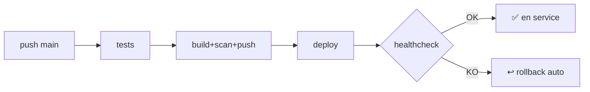

# Déploiement — PN-RAVEC

## Principe

Le développeur ne fait que :

```bash
git push origin main
```

Le pipeline `cd.yml` se charge de **tout** : tests → build → scan → push GHCR →
déploiement (runner self-hosted) → backup → healthcheck → rollback automatique si échec.

## Préparation (une seule fois)

### 0. Runner self-hosted (obligatoire — serveur sur réseau privé)
Le job `deploy` tourne sur un runner installé **sur le serveur**. Installation et
configuration : voir **[SELF_HOSTED_RUNNER.md](SELF_HOSTED_RUNNER.md)**.

### 1. Secret GitHub
Un seul requis : `GHCR_TOKEN` (PAT `write:packages`). Voir
[GITHUB_ACTIONS.md](GITHUB_ACTIONS.md#secrets-github-requis). Plus de secrets SSH.

### 2. Serveur Ubuntu

```bash
# Dossier applicatif
sudo mkdir -p /opt/pn-ravec && sudo chown $USER:$USER /opt/pn-ravec
cd /opt/pn-ravec

# Configuration (à partir du modèle versionné)
cp .env.server.example .env
nano .env            # renseigner les secrets réels

# Pré-requis : Docker + Docker Compose v2
docker --version && docker compose version
```

Le pipeline copie automatiquement `docker-compose.server.yml` et le dossier `ops/`
à chaque déploiement. Le `.env` reste **uniquement** sur le serveur (jamais versionné).

### 3. Connexion GHCR côté serveur
Gérée par le pipeline (`docker login ghcr.io` via `GHCR_TOKEN`). Pour un test manuel :

```bash
echo "<PAT read:packages>" | docker login ghcr.io -u <user> --password-stdin
```

## Déploiement automatique



## Déploiement manuel (dépannage)

Sur le serveur, si besoin de déployer une version précise sans pipeline :

```bash
cd /opt/pn-ravec
export BACKEND_IMAGE=ghcr.io/lamarana55/ravec-backend:sha-<commit>
export FRONTEND_IMAGE=ghcr.io/lamarana55/ravec-frontend:sha-<commit>
docker compose -f docker-compose.server.yml --env-file .env pull
docker compose -f docker-compose.server.yml --env-file .env up -d
./ops/healthcheck.sh
```

## Vérification post-déploiement

```bash
./ops/healthcheck.sh                       # db + backend + frontend
docker compose -f docker-compose.server.yml ps
docker exec ravec-pn-frontend wget -qO- http://backend:8091/api/v1/actuator/health
```

## Outils optionnels

```bash
# PgAdmin (profil tools)
docker compose -f docker-compose.server.yml --env-file .env --profile tools up -d pgadmin
# → http://127.0.0.1:5051
```

## En cas de problème
- **Rollback** : voir [ROLLBACK.md](ROLLBACK.md).
- **Restauration BD** : voir [BACKUP.md](BACKUP.md).
- **Logs** : `docker compose -f docker-compose.server.yml logs -f backend`.
