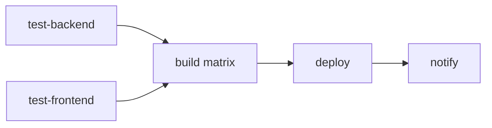

# GitHub Actions — PN-RAVEC

## Workflows

| Fichier | Déclencheur | Rôle |
|---------|-------------|------|
| `ci.yml` | PR vers `main`, push sur branches ≠ `main` | Tests backend + frontend + lint |
| `cd.yml` | push sur `main` | Tests → build → scan → push → deploy → healthcheck → rollback auto |
| `rollback.yml` | manuel (`workflow_dispatch`) | Rollback vers un tag choisi |

## Pipeline CD (cd.yml)

1. **test-backend** / **test-frontend** : barrière qualité (Postgres service + Karma headless).
2. **build** (matrice backend/frontend, en parallèle) : build local → **Trivy** (SARIF dans l'onglet Security) → push `sha-<commit>` + `latest`.
3. **deploy** : `scp` du compose + scripts `ops/`, puis SSH → backup DB → pull/up par SHA → `healthcheck.sh` → **rollback auto** si KO.
4. **notify** : résumé dans `GITHUB_STEP_SUMMARY`, échec marqué rouge (email natif GitHub).

## Secrets GitHub requis

À définir dans **Settings → Secrets and variables → Actions** :

| Secret | Description |
|--------|-------------|
| `SERVER_HOST` | IP/host du serveur de production |
| `SERVER_USER` | Utilisateur SSH (ex. `appva`) |
| `SERVER_SSH_KEY` | Clé privée SSH (PEM) autorisée sur le serveur |
| `SERVER_PORT` | Port SSH (optionnel, défaut 22) |
| `GHCR_TOKEN` | PAT GitHub avec `read:packages` (login GHCR côté serveur) |
| `GHCR_USER` | Utilisateur GHCR (optionnel, défaut = acteur du run) |

> `GITHUB_TOKEN` est fourni automatiquement (push GHCR depuis le runner).

## Environnement `production`

Le job `deploy` utilise l'environnement GitHub `production`. On peut y ajouter une
**règle d'approbation manuelle** (Settings → Environments → production → Required reviewers)
pour exiger une validation humaine avant chaque mise en production.

## Permissions

Permissions minimales par job :
- `build` : `contents: read`, `packages: write`, `security-events: write`.
- autres : `contents: read` par défaut.

## Bonnes pratiques appliquées

- `concurrency` : un seul déploiement à la fois (`cd-production`), pas d'annulation en vol.
- Tags d'actions épinglés (versions explicites).
- Cache GHA pour les builds Docker (`type=gha`).
- Scan de vulnérabilités avant publication.
- Namespace GHCR en minuscules (`lamarana55`) — évite l'échec de push lié à la casse.

## Rendre le scan bloquant

Dans `cd.yml`, étape Trivy : passer `exit-code: '0'` → `exit-code: '1'` pour **bloquer**
le pipeline en cas de vulnérabilité `CRITICAL`/`HIGH` corrigeable.
