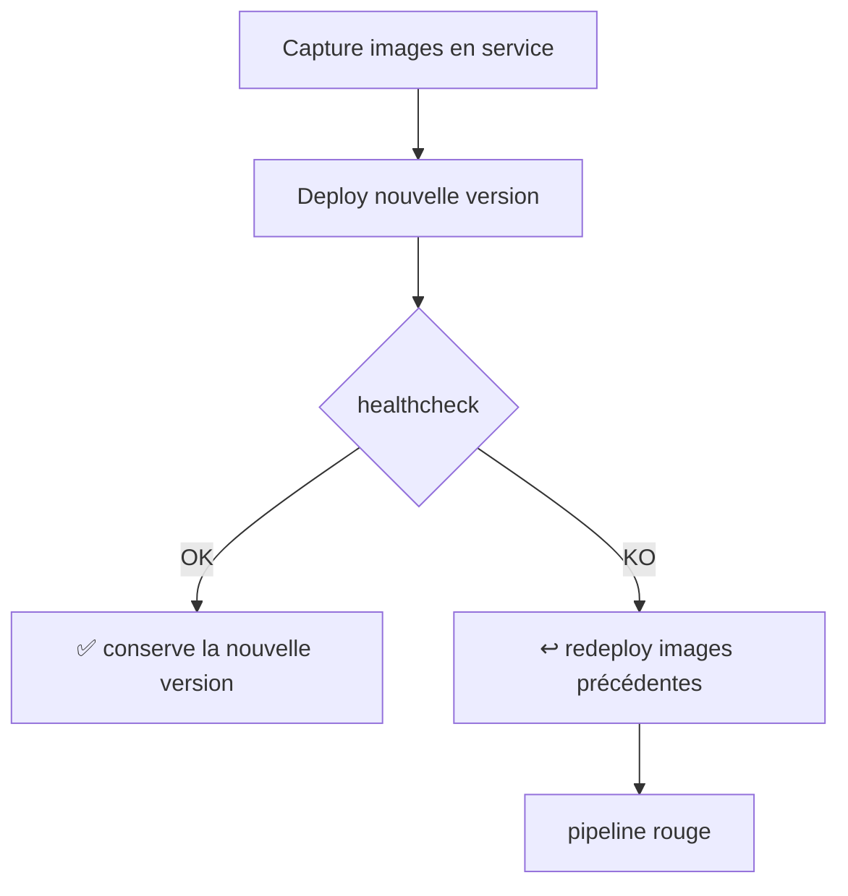

# Rollback — PN-RAVEC

Revenir **instantanément** à une version applicative précédente.

## 1. Rollback automatique (intégré au déploiement)

À chaque déploiement, `cd.yml` :
1. mémorise les images **actuellement en service** (`docker inspect`) ;
2. déploie les nouvelles images ;
3. lance `ops/healthcheck.sh`.

Si le healthcheck **échoue**, le pipeline **redéploie automatiquement** les images
précédentes et marque le run en échec. Aucune action manuelle nécessaire.



## 2. Rollback manuel — via GitHub Actions

Onglet **Actions → « Rollback — Production » → Run workflow** :
- `image_tag` : le tag à redéployer (ex. `sha-<commit>`). Laisser **vide** pour reprendre
  le dernier déploiement réussi enregistré (`.last_successful_deploy`).
- `reason` : motif (traçabilité).

## 3. Rollback manuel — en SSH sur le serveur

```bash
cd /opt/pn-ravec

# Vers un commit précis
./ops/rollback.sh sha-1a2b3c4

# Vers le dernier déploiement réussi enregistré
./ops/rollback.sh

# Lister les déploiements passés
cat deploy-history.log
```

`ops/rollback.sh` effectue : backup de sécurité → pull → `up -d` → healthcheck, puis
met à jour `.last_successful_deploy` si tout est vert.

## 4. Retrouver un tag à redéployer

- **GHCR** : `https://github.com/Lamarana55?tab=packages` → `ravec-backend` / `ravec-frontend` → onglet des versions.
- **Historique serveur** : `cat /opt/pn-ravec/deploy-history.log`.
- **Git** : `git log --oneline` (le SHA du commit = tag `sha-<commit>`).

## 5. Bon à savoir

- Le rollback est **applicatif** (images). Il ne restaure **pas** la base de données.
  Si une migration de schéma a modifié la base, voir [BACKUP.md](BACKUP.md) pour restaurer.
- Les images antérieures doivent encore exister dans GHCR (politique de rétention GHCR).
