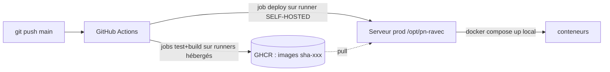

# Runner self-hosted & déploiement automatique — PN-RAVEC

Le serveur de prod est sur un **réseau privé** (`172.16.45.4`). Les runners GitHub
hébergés ne peuvent pas l'atteindre. On installe donc un **runner self-hosted
directement sur le serveur** : le déploiement devient **local** (aucun SSH, rien
d'exposé sur Internet).



- **test** + **build/scan/push** → runners GitHub **hébergés** (rapides, isolés).
- **deploy** + **rollback** → runner **self-hosted** (`runs-on: [self-hosted, ravec-prod]`).

---

## 1. Pré-requis sur le serveur

```bash
# Docker + Docker Compose v2
docker --version && docker compose version

# Dossier applicatif appartenant à l'utilisateur qui fera tourner le runner
sudo mkdir -p /opt/pn-ravec
sudo chown -R $USER:$USER /opt/pn-ravec

# Configuration de prod (jamais versionnée)
cd /opt/pn-ravec
cp /chemin/vers/repo/.env.server.example .env
nano .env            # renseigner DB, JWT, SMTP, NimbaSMS, GRAFANA…
```

> L'utilisateur du runner doit pouvoir lancer `docker` (être dans le groupe `docker`) :
> `sudo usermod -aG docker $USER` puis re-login.

## 2. Installer le runner self-hosted

GitHub → **Settings → Actions → Runners → New self-hosted runner** (Linux x64).
Suivre les commandes affichées (elles incluent un token d'enregistrement), en
**ajoutant le label `ravec-prod`** :

```bash
# Exemple (adapter version + token fournis par GitHub) :
mkdir -p ~/actions-runner && cd ~/actions-runner
curl -o actions-runner-linux-x64.tar.gz -L \
  https://github.com/actions/runner/releases/download/vX.Y.Z/actions-runner-linux-x64-X.Y.Z.tar.gz
tar xzf actions-runner-linux-x64.tar.gz

# Enregistrement avec le label attendu par les workflows
./config.sh --url https://github.com/Lamarana55/Project-numerisation-actes-MMG \
            --token <TOKEN_FOURNI_PAR_GITHUB> \
            --labels ravec-prod \
            --name ravec-prod-runner --unattended

# Installer en service (démarrage auto)
sudo ./svc.sh install
sudo ./svc.sh start
sudo ./svc.sh status
```

Le label **`ravec-prod`** est indispensable : les jobs `deploy`/`rollback` ciblent
`runs-on: [self-hosted, ravec-prod]`.

## 3. Secret GitHub requis (un seul)

Settings → Secrets and variables → Actions :

| Secret | Description |
|--------|-------------|
| `GHCR_TOKEN` | PAT GitHub (classic) avec scope **`write:packages`** + **`read:packages`** — sert au login GHCR (build push + pull serveur) |
| `GHCR_USER` | *(optionnel)* utilisateur GHCR ; défaut = acteur du run |

> Plus besoin de `SERVER_HOST`, `SERVER_USER`, `SERVER_SSH_KEY` : le déploiement
> est local au runner. Le PAT `GHCR_TOKEN` (propriétaire des packages) évite aussi
> le 403 de push même si les packages ne sont pas liés au dépôt.

Création rapide en CLI (à exécuter toi-même, valeur saisie en sécurité) :

```bash
gh secret set GHCR_TOKEN          # colle ton PAT quand demandé
gh secret set GHCR_USER --body "lamarana55"
```

## 4. Sécuriser la mise en production (recommandé)

Settings → **Environments → production** :
- **Required reviewers** : exiger une approbation manuelle avant que le job `deploy`
  ne s'exécute (utile même en auto-deploy).
- Limiter l'environnement à la branche `main`.

## 5. Vérifier

```bash
# Le runner doit apparaître "Idle" :
#   GitHub → Settings → Actions → Runners
# Test : pousser un commit sur main → le job deploy doit tourner sur ravec-prod.
sudo ./svc.sh status
docker compose -f /opt/pn-ravec/docker-compose.server.yml --env-file /opt/pn-ravec/.env ps
```

## Dépannage

| Symptôme | Cause / solution |
|----------|------------------|
| Job `deploy` reste en attente | Runner hors-ligne ou label manquant → `sudo ./svc.sh status`, vérifier le label `ravec-prod` |
| `permission denied` Docker | Utilisateur du runner pas dans le groupe `docker` |
| `$APP_DIR/.env introuvable` | Créer `/opt/pn-ravec/.env` depuis `.env.server.example` |
| Push GHCR 403 | `GHCR_TOKEN` absent/insuffisant (scope `write:packages`) |
